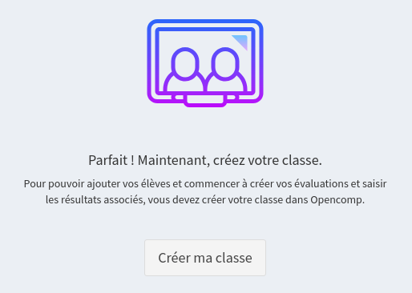
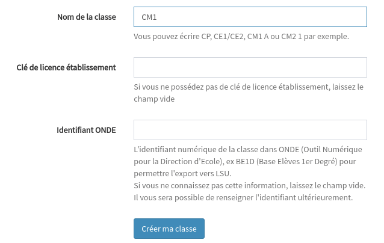

# Créer ma classe

Depuis la page d'accueil, cliquez sur le bouton "**Créer ma classe"**.

Renseignez ensuite le formulaire de création de classe.

## Nom de la classe

Il s'agit du nom de votre classe dans Opencomp. Ce nom vous permet d'identifier votre classe dans Opencomp. Il est indiqué dans le fil d'ariane \(en violet, en haut\) et dans la barre latérale \(en noir, à gauche\). Utilisez de préférence un nom court \(le niveau de votre classe par exemple\).

## Clé de licence établissement

Si une personne de votre établissement a déjà effectué une commande de licences Opencomp et qu'elle vous a communiqué une clé de licence établissement, renseignez la lors de la création de votre classe pour l'activer directement.

Sans clé de licence établissement, la classe est automatiquement rattachée à votre licence personnelle qui débute par un essai gratuit de 30 jours à partir de votre date d'inscription.

## Identifiant ONDE

L’identifiant ONDE vous permet d'exporter vers LSU quand vous le désirez. Vous n'êtes pas obligé de renseigner immédiatement cette information si vous ne la connaissez pas initialement.

Pour savoir comment récupérer cet identifiant, consultez cette page.



