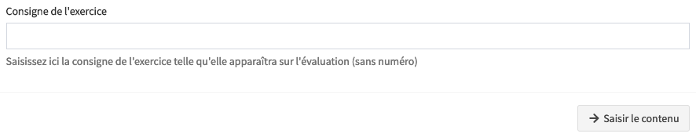
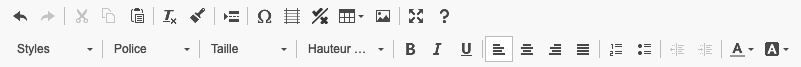
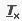
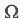
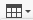

# Créer mes exercices

Avant de pouvoir ajouter/créer des exercices dans une évaluation, vous devez d'abord avoir [**créé l'évaluation.**](../../creer-une-nouvelle-evaluation)

Si vous avez déjà créé l'évaluation, vous pouvez y ajouter des exercices depuis la page **Contenu de l'évaluation**.

Pour accéder à la page **Contenu de l'évaluation **d'une évaluation déjà existante, procédez comme suit :

1. Depuis le tableau de bord, cliquez sur le bouton **Évaluations** dans la section **Accès rapide** de votre classe.
2. Depuis la liste des évaluations, cliquez sur le titre de l'évaluation pour accéder au **Contenu de l'évaluation**.

:::note

Vous n'êtes pas obligé d'ajouter des exercices à une évaluation. Vous pouvez simplement y associer des compétences évaluées (pour des évaluations réalisées sans Opencomp, par exemple à l'aide de votre traitement de texte habituel).

:::

## Renseigner la consigne

:::caution **Ne numérotez pas la consigne.**

Opencomp numérote automatiquement vos exercices (ce qui permet également un re-numérotation automatique lorsque vous déplacez les exercices après coup).

:::

:::note

La consigne est automatiquement formatée en gras. Il n'est actuellement pas possible de formatter la consigne de façon personalisée. Vous pouvez, si vous avez absolument besoin de formater la consigne, indiquer une consigne générique du type : "**Réponds aux questions**" et renseigner et formater les consignes dans le corps de l'exercice.

:::

## Renseigner le corps

### Mettre en forme 

Nous allons détailler l'ensemble des outils disponibles pour la mise en forme et leur utilité (de haut en bas et de gauche à droite) :

*  **Annuler :** Permet d'annuler la dernière action que vous venez d'effectuer.
*  **Rétablir :** Permet rétablir la dernière annulation effectuée.
*  **Couper :** Permet de couper le texte sélectionné (le place dans le presse-papier)
*  **Copier : **Permet de copier le texte sélectionné (le place dans le presse-papier)
*  **Coller :** Permet de coller un texte déjà présent dans le presse-papier système vers le corps de l'exercice. Votre navigateur peut restreindre cette possibilité et vous devrez peut-être utiliser la combinaison de touches `Ctrl+V` sur _Windows_ et `⌘+V` sur _macOS_.
*  **Supprimer la mise en forme :** Supprime la mise en forme du texte sélectionné. Le texte revient à la mise en forme par défaut (police Roboto, taille de 11, aligné à gauche, suppression des styles prédéfinis éventuellement sélectionnés et suppression de l'interlignage).
*  **Copier la mise en forme :** Permet de copier la mise en forme d'un texte vers un autre. Par exemple, si vous avez formatté un texte en gras et en vert, commencez par sélectionner le texte déjà formaté puis cliquez sur l'icône **Copier la mise en forme**. Sélectionnez ensuite le texte pour lequel vous souhaitez appliquer la mise en forme copiée.
*  **Insérer un saut de page pour l'impression :** Permet de forcer l'insertion d'un saut de page manuel. Lors d'un clic sur cette icône, une double ligne apparaît pour représenter le saut de page. Le contenu placé sous cette ligne sera imprimé sur la page suivante.
*  **Insérer un caractère spécial :** Permet d'insérer des caractères spéciaux difficiles à insérer directement avec le clavier : symboles mathématiques, puces, flèches, cases à cocher et lettres de l'alphabet phonétique international.
*  **Insérer des réglures Seyès :** Permet d'insérer des réglures Seyès. Les réglures sont modulables en nombre de lignes et en nombre de carreaux de large.
*  **Insérer un Vrai/Faux :** Permet d'insérer rapidement un exercice de Vrai/Faux. L'exercice est présenté sous la forme d'un tableau à trois colonnes : la première, contenant les affirmations et les deux suivantes contenant des cases à cocher permettant à l'élève d'indiquer si l'affirmation est Vraie, ou Fausse.
*  **Insérer un tableau :** Permet d'insérer rapidement un tableau. Cliquez sur l'icône puis survolez le nombre de colonnes de large et le nombre de lignes de haut pour les mettre en surbrillance puis effectuez un clic gauche pour insérer le tableau.
*  **Insérer une image :** Permet d'insérer rapidement une image. Après avoir cliqué sur l'icône, cliquez sur "**Parcourir...**" sur Windows ou sur "**Choisir un fichier**" sur macOS puis double-cliquez sur le fichier que vous souhaitez insérer depuis votre ordinateur dans la boîte de dialogue de sélection de fichier qui s'affiche. Cliquez ensuite sur **Envoyer sur le serveur** pour insérer l'image dans le corps de l'exercice. Vous pouvez également **glisser-déposer** une image depuis votre ordinateur à l'endroit où vous souhaitez l'insérer dans le corps de l'exercice. Dernière possibilité, vous pouvez copier/coller une image depuis un site Internet : depuis le site Internet, effectuez un clic droit sur l'image et sélectionnez "**Copier l'image**" puis placez vous à l'endroit où vous souhaitez la coller dans le corps de l'exercice et utilisez la combinaison de touches `Ctrl+V` sur _Windows_ et `⌘+V` sur _macOS_ pour la coller.
*  **Agrandir :** Permet d'agrandir l'édteur de texte (plein écran).
*  **À propos :** Affiche les informations de licence sur l'éditeur.

----

* Styles :
  * Encadré :
  * Mot étiquette :
* Police :
  * Par défaut ou Roboto :
  * ÉcritureA :
  * OpenDyslexic3
* Taille de police :
* Hauteur de ligne :
* Gras :
* Italique :
* Souligner :
* Aligner à gauche :
* Aligner au centre :
* Aligner à droite :
* Insérer une liste ordonnée (numérotée) :
* Insérer une liste non ordonnée (à puces) :
* Diminuer le retrait :
* Augmenter le retrait :
* Couleur du texte :
* Couleur d'arrière plan (surlignage) :

### Outils exclusif d'Opencomp

Certains outils très pratiques ont été développés spécialement pour vous et ne sont disponibles que dans Opencomp. Vous pouvez les découvrir ci-dessous.

#### Insérer des réglures Seyès

<figure class="video-container">
<iframe src="//www.youtube-nocookie.com/embed/21BgZaLM9os?rel=0" frameborder="0" allowfullscreen width="100%"></iframe>
</figure>

#### Insérer un Vrai/Faux

<figure class="video-container">
<iframe src="//www.youtube-nocookie.com/embed/j5ZGgV5ZWTs?rel=0" frameborder="0" allowfullscreen width="100%"></iframe>
</figure>
