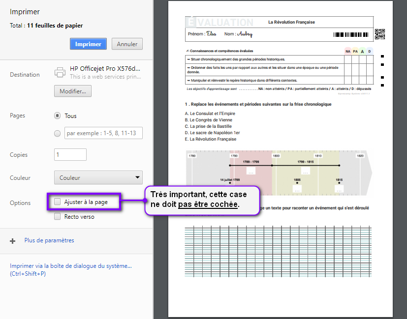
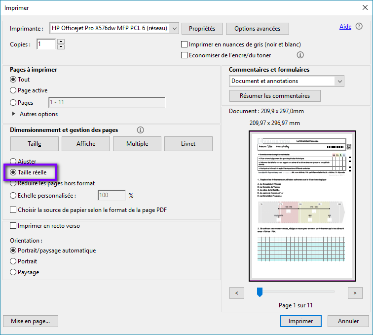
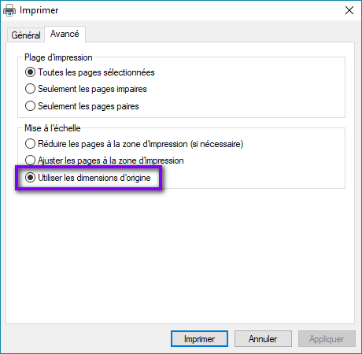

# Imprimer mon évaluation

1. Depuis le tableau de bord, cliquez sur le bouton **Évaluations** dans la section **Accès rapide** de votre classe.
2. Depuis la liste des évaluations, cliquez sur le titre de l'évaluation pour accéder au **Contenu de l'évaluation**.

import Tabs from '@theme/Tabs';
import TabItem from '@theme/TabItem';

<Tabs>
<TabItem value="chromium-based" label="Avec Chrome/Chromium" default>

:::note

Si vous utilisez Chrome ou Chromium, vous pouvez utiliser la fonction d'impression directe **au sein du navigateur**.

:::

Dans le cadre **Aperçu de l'évaluation**, cliquez sur le bouton **Imprimer**, à droite.

:::caution Attention

Veillez à ce que la case **Ajuster à la page** ne soit _**PAS cochée**_.

:::

:::note

Il est **très important** de veiller à imprimer en **taille réelle (à 100%)** car certains éléments comme les réglures Seyès par exemple seront trop petits si vous laissez le navigateur ajuster à la page. De plus, cela peut poser des problème de détection si vous utiliser ensuite [Opencomp Genie](/saisir-les-resultats/utiliser-opencomp-genie/README) pour détecter automatiquement les résultats de vos élèves.

:::

</TabItem>

<TabItem value="other-browser" label="Avec un autre navigateur">

:::note

_Nous vous recommandons fortement l'utilisation de Chrome, c'est un navigateur gratuit, rapide et performant._

_Vous pouvez télécharger et installer Chrome même si vous n'êtes pas administrateur de la machine en depuis l'adresse suivante : h_[_ttps://www.google.com/chrome/browser/desktop/index.html_](https://www.google.com/chrome/browser/desktop/index.html)_._

:::

Si vous utilisez un autre navigateur que Chrome/Chromium, la fonction d'impression directe au sein du navigateur n'est pas disponible et vous devrez télécharger les copies au format PDF et utiliser le logiciel de lecture de PDF de votre ordinateur pour les imprimer.

Une fois téléchargé, ouvrez le fichier avec le logiciel de lecture de PDF de votre ordinateur (**Adobe Acrobat Reader** ou **Sumatra PDF** par exemple).

:::caution Attention

En particulier **sur Firefox ou Microsoft Edge, il est très important de ne pas ouvrir/imprimer le PDF en utilisant le lecteur intégré du navigateur** (le QR code de l'évaluation ne serait ensuite pas reconnu par [Opencomp Genie](/saisir-les-resultats/utiliser-opencomp-genie/README)).

:::

_Si vous ne disposez pas d'un lecteur de fichier PDF :_

* _installez _[_**Adobe Acrobat Reader DC**_](https://get.adobe.com/fr/reader/enterprise/)_ si vous disposez des droits administrateur sur la machine._
* _téléchargez _[_**la version portable de Sumatra PDF**_](https://www.sumatrapdfreader.org/dl/SumatraPDF-3.1.2.zip)_ si vous ne disposez pas des droits administrateur sur la machine._

Une fois ouvert dans votre lecteur de PDF, choisissez l'option permettant d'imprimer **sans redimensionner où ajuster le PDF **(taille réelle).

</TabItem>
</Tabs>
