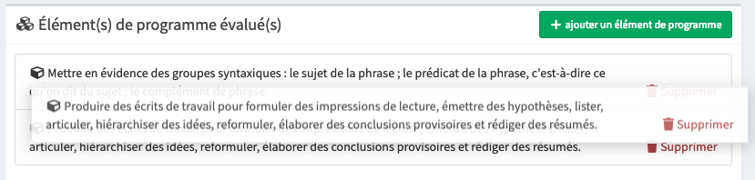

# Modifier les éléments insérés

## Ré-ordonner les éléments insérés

Pour modifier l'ordre des exercices ou des éléments de programme, vous pouvez les glisser.

Cliquez simplement sur l'élément à déplacer, puis, tout en maintenant le bouton gauche de la souris enfoncé, faites glisser l'élément à sa nouvelle place. Relâchez le bouton gauche de la souris.

La nouvelle place de l'élément est automatiquement enregistrée et l'aperçu de votre évaluation est actualisé afin que vous puissiez observer les changements.

## Modifier les éléments de programme évalués

## Modifier les exercices

