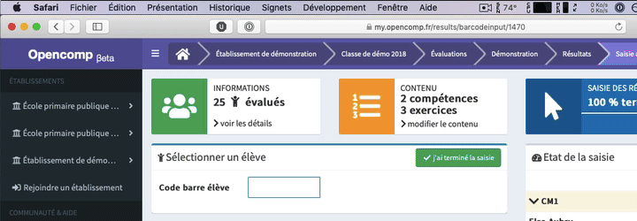

# Saisir avec des codes à barres

## Résolution de problèmes

### Je n'entends pas les sons de succès et d'erreur sur Safari

Depuis les dernières versions de Safari sur macOS, les sites web que vous consultez doivent avoir été explicitement autorisés à jouer des sons de manière automatique.

Pour entendre les sons de confirmation d'enregistrement à la fin d'une copie, d'erreur de saisie et de succès lorsque la saisie d'un paquet de copies est terminé, vous pouvez procéder de la sorte :

1. Cliquez sur **Safari** dans la barre de menus de votre Mac
2. Sélectionnez **Réglages pour ce site web...**
3. Dans la fenêtre pop-up qui apparaît, pour l'option **Lecture automatique**, déroulez la liste déroulante en cliquant dessus et sélectionnez l'option **Toujours autoriser la lecture automatique**.

