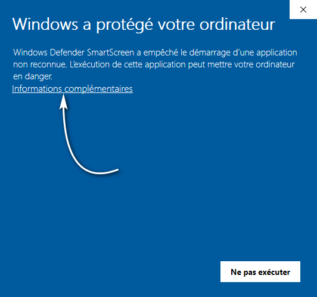
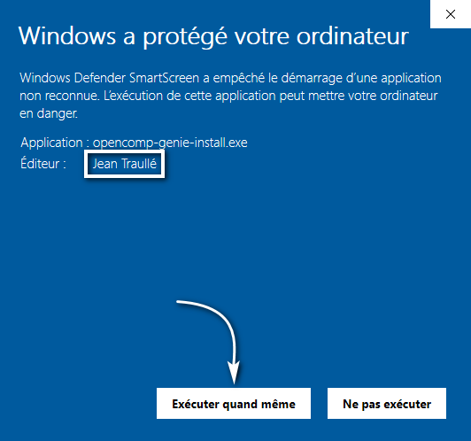
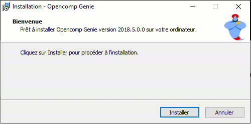

# Windows

## Depuis le Microsoft Store (Windows 10)

Recherchez** Opencomp Genie** dans le Microsoft Store ou [accédez à l'URL suivante](https://www.microsoft.com/fr-fr/p/opencomp-genie/9ng17jn52232?activetab=pivot:overviewtab).

## Depuis le site

### 1. Télécharger

Rendez-vous à l'adresse [https://genie.opencomp.fr](https://genie.opencomp.fr) et cliquez sur le bouton **Télécharger Opencomp Genie \[...] pour Windows**. 

Si vous souhaitez télécharger la version Windows du logiciel depuis un ordinateur n'exécutant pas Windows, vous pouvez utiliser le lien suivant : [https://genie.opencomp.fr/opencomp-genie-install.exe](https://genie.opencomp.fr/opencomp-genie-install.exe)

### 2. Autoriser l'exécution

Ouvrez votre dossier **Téléchargements **et double cliquez sur le fichier **opencomp-genie-install.exe**

Depuis Windows 8, le système d'exploitation de Microsoft inclut un système de réputation de fichiers (appelé filtre **SmartScreen**). Si le programme d'installation de **Opencomp Genie** n'a pas été téléchargé par un nombre minimum d'utilisateurs, un message d'avertissement que vous devez valider peut apparaître.

### 3. Installer

Cliquez sur Installer pour installer **Opencomp Genie** sur votre ordinateur.

:::note

L'installation de l'application ne nécessite pas les droits d'administrateur.

:::

