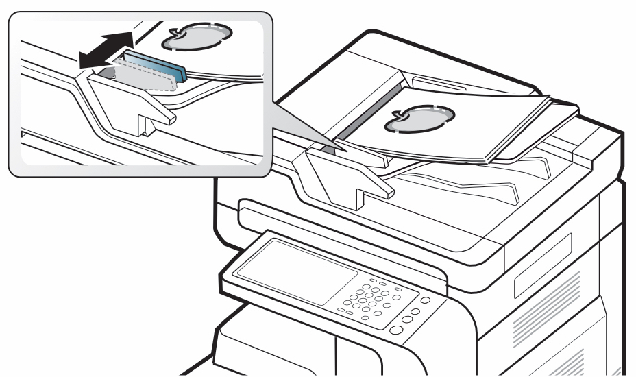
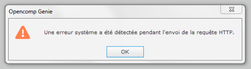
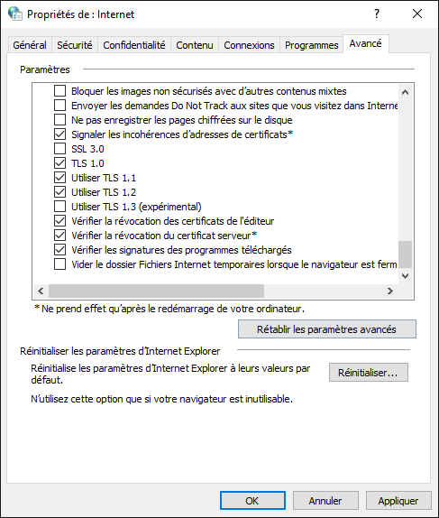

# Résoudre les problèmes

## Pourquoi Opencomp Genie ne détecte pas mes résultats ?

La détection des résultats est liée à la bonne "lecture" de chaque copie par le programme.

Voici quelques pistes qui peuvent vous permettre d'améliorer la détection des résultats :

### 1. Imprimer à la bonne taille

* Assurez-vous d'**imprimer convenablement vos copies**. C'est à dire en taille réelle (sans ajuster à la page). Voir l'article [Comment imprimer mes évaluations ?](/creer-mes-evaluations/imprimer-mon-evaluation) pour davantage de précisions.

### 2. Numériser les copies droites, à bonne résolution et sans compression

* Assurez-vous que **les copies sont scannées **_**droites**_.\
  Soyez donc particulièrement vigilent(e) à ce que les taquets du chargeur automatique de document touchent les bords de la pile de copies.

* Assurez-vous que **les copies sont scannées **_**à bonne résolution**_.\
  La résolution de numérisation recommandée est de 300 ppp/dpi
* Assurez-vous que **les copies sont scannées **_**en désactivant les fonctions éventuelles de compression des images**_.

### 3. Corriger avec le bon stylo

* Utiliser un **stylo-feutre** (de type [Paper Mate Flair](https://amzn.to/2IYqiAo), [Pilot V-Sign Pen](https://amzn.to/2qmdBEZ) ou [Uni-ball Sign Pen](https://amzn.to/2qhFpdI)) pour corriger peut permettre d'améliorer la détection des résultats car le tracé est plus épais. Ceci est d'autant plus vrai si vous utilisez une couleur claire (comme du rouge par exemple).
* Les **rollers à encre liquide** donnent également de très bons résultats lorsque la couleur de l'encre est vive ou foncée (éviter les couleurs trop claires : vert pomme, rose, orange). La bonne détection a été testée avec succès avec des rollers à encre liquide rouge [Uni-ball EYE Fine UB-157](https://amzn.to/2FIa6Bt) et [Pilot V-Ball 10](https://amzn.to/2Xb6L3t).
* D'une manière générale, **ne pas utiliser de roller à encre liquide à pointe plus fine que 0.7 mm**.
* **N'utilisez pas de stylos à encre gel effaçables** (de type Pilot FriXion, Uni-ball Phantom ou BIC Gel-ocity Illusion). Ces stylos ont une couleur d'encre trop pâle qui entraînera des absences de détection pour certains résultats.
* Utiliser une **couleur de stylo/stylo-feutre**_** plus foncée**_ (comme du violet par exemple : [Pilot V-Sign Pen violet](https://amzn.to/2qmdBEZ)) peut permettre d'améliorer la détection des résultats (bien que l'utilisation du rouge montre normalement d'excellents résultats si les copies sont scannées droites et imprimées en taille réelle)

:::note

Si vous n'avez jamais essayé de détecter les résultats, commencez par faire un essai avec la numérisation d'une seule copie et [contactez le support](https://opencomp.fr/a-propos/contact/) en cas d'échec de détection avant de continuer (nous pourrons vous aider et vous indiquer les éventuels points de blocage).

:::

## Pourquoi Opencomp Genie n'arrive pas à se connecter ?

_Vous trouverez ci-dessous une résolution des différents messages d'erreur que vous pouvez rencontrer._

### Une erreur système a été détectée pendant l'envoi de la requête HTTP.

:::note

Cette erreur se produit généralement en raison d'une erreur de configuration des **Options Internet** de votre système Windows.

:::

* Lancez Microsoft **Internet Explorer** (et non Microsoft Edge).
* Cliquez sur l’icône **Outils**   située en haut à droite de votre écran.
* Dans le menu qui apparaît, sélectionnez **Options Internet**.
* Sélectionnez l'onglet **Avancé**.
* Faites défiler la liste de paramètres proposée pour afficher le bas de la liste et assurez vous que les paramètres **Utiliser TLS 1.1** et **Utiliser TLS 1.2** sont bien cochés (si ce n'est pas le cas, cochez-les).
* Cliquez sur **Appliquer** puis sur **OK**.

