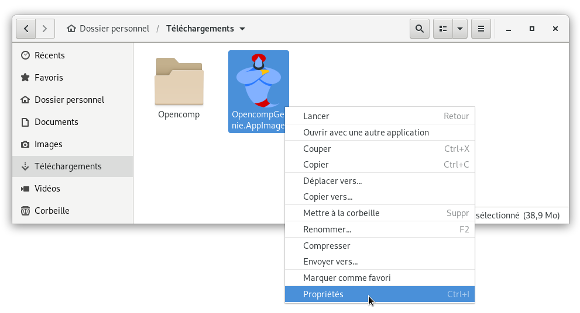
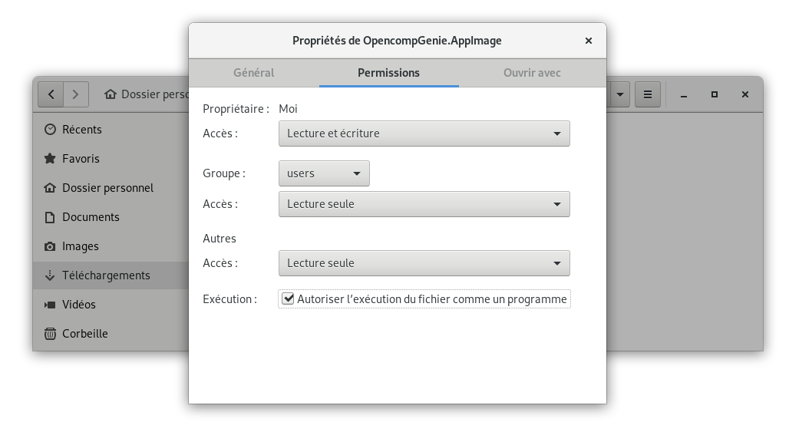

# GNU/Linux

## 1. Télécharger

Rendez-vous à l'adresse [https://genie.opencomp.fr](https://genie.opencomp.fr) et cliquez sur le bouton **Télécharger Opencomp Genie \[...] pour GNU/Linux**. 

Si vous souhaitez télécharger la version GNU/Linux du logiciel depuis un ordinateur n'exécutant pas GNU/Linux, vous pouvez utiliser le lien suivant : [https://genie.opencomp.fr/OpencompGenie.AppImage](https://genie.opencomp.fr/OpencompGenie.AppImage)

## 2. Autoriser l'exécution

import Tabs from '@theme/Tabs';
import TabItem from '@theme/TabItem';

<Tabs>
<TabItem value="gui" label="Méthode graphique" default>

Accédez à votre dossier **Téléchargements** puis, effectuez un clic droit sur le fichier **OpencompGenie.AppImage** que vous venez de télécharger et sélectionnez l'option de menu **Propriétés.**



Dans la boîte de dialogue **Propriétés de OpencompGenie.AppImage**, sélectionnez l'onglet **Permissions** et cochez la case **Autoriser l'exécution du fichier comme un programme** et fermez la fenêtre.


</TabItem>

<TabItem value="cli" label="Méthode en ligne de commandes">

Utilisez la commande `chmod` pour ajouter les droits d'exécution au fichier téléchargé.

```bash
chmod u+x ~/Téléchargements/OpencompGenie.AppImage
```
</TabItem>
</Tabs>

## 3. Lancer

Il ne vous reste plus qu'à lancer **Opencomp Genie** en double cliquant sur le fichier **OpencompGenie.AppImage**

## **Intégration au système (facultatif)**

Si vous souhaitez ajouter **Opencomp Genie** aux menus de votre distribution GNU/Linux, vous pouvez utiliser le logiciel `appimaged` pour cette tâche.

Depuis un terminal, exécutez les commandes suivantes :

```bash
cd ~/Téléchargements
wget "https://github.com/AppImage/appimaged/releases/download/continuous/appimaged-x86_64.AppImage"
chmod a+x appimaged-x86_64.AppImage

./appimaged-x86_64.AppImage --install
```

:::note

Pour des informations à jour sur l'installation de`appimaged`, vous pouvez consultez [le fichier Lisez-moi](https://github.com/AppImage/appimaged/blob/master/README.md#install) de l'utilitaire (en anglais).

:::

