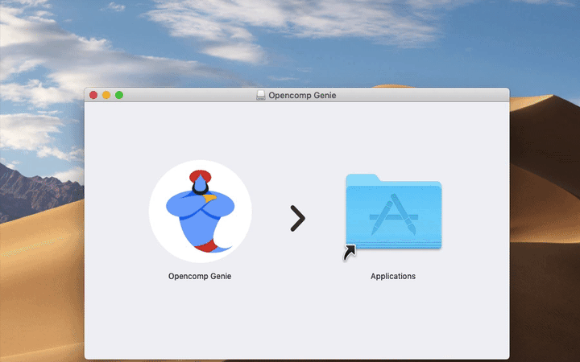
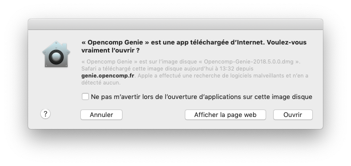
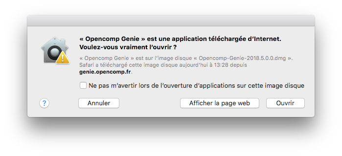

# OS X et macOS

## 1. Télécharger

Rendez-vous à l'adresse [https://genie.opencomp.fr](https://genie.opencomp.fr) et cliquez sur le bouton **Télécharger Opencomp Genie \[...] pour macOS**. 

## 2. Installer

* Cliquez sur la première icône de votre **Dock** pour lancer l'application **Finder**.
* Dans la barre latérale du **Finder**, sélectionnez **Téléchargements **dans la section **Favoris**.
* Double-cliquez sur le fichier **Opencomp-Genie-\[xxxx.x.x.x].dmg**  pour ouvrir l'image disque précédemment téléchargée depuis le site.
* **Glissez **l'icône d'**Opencomp Genie** vers votre dossier "**Applications**".

## 3. Lancer

* Cliquez sur la première icône de votre **Dock** pour lancer l'application **Finder**.
* Dans la barre latérale du **Finder**, sélectionnez **Applications** dans la section **Favoris**.
* Double-cliquez sur l'application **Opencomp Genie** pour la lancer.

### Autoriser l'exécution pour la première fois

:::note

Lors de la première ouverture, vous devrez valider la fenêtre de sécurité de Gatekeeper.

:::

import Tabs from '@theme/Tabs';
import TabItem from '@theme/TabItem';

<Tabs>
<TabItem value="macos1014" label="macOS 10.14 et supérieur" default>

</TabItem>

<TabItem value="macos1013" label="macOS 10.13 et antérieur">

</TabItem>
</Tabs>
