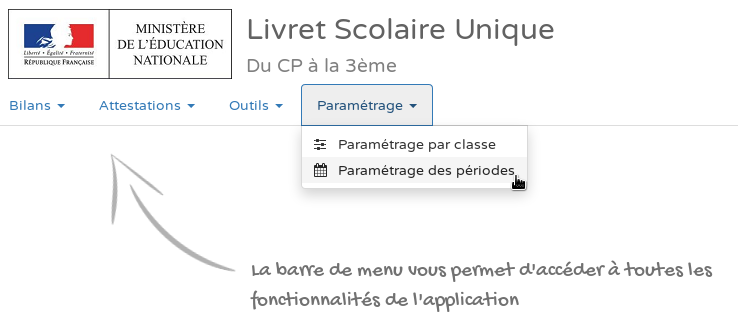
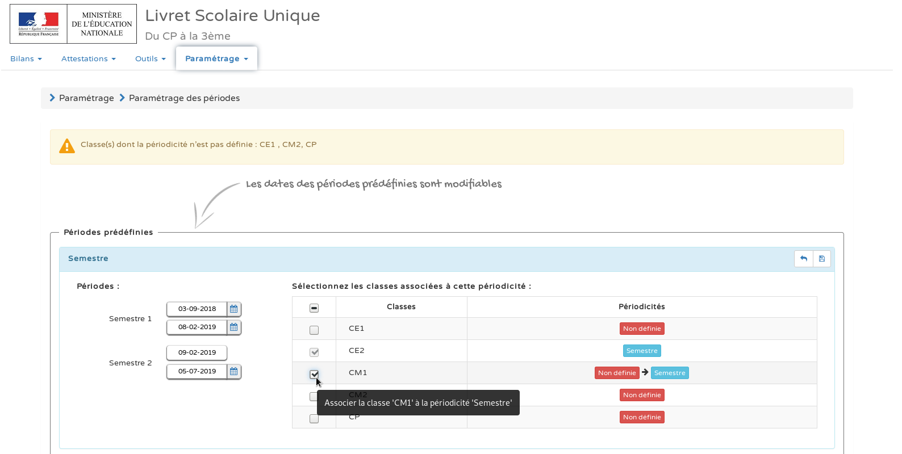

# Paramétrer les périodes

:::note

Vous pouvez modifier si vous le souhaitez les dates prédéfinies par défaut.

:::

Cliquez sur l'icône de la disquette en haut, à droite pour valider et enregistrer vos modifications.

:::tip

Vos classes sont associées à des périodes dans LSU et vous avez modifié les dates des périodes si vous le souhaitiez ; passons à la suite !

:::

