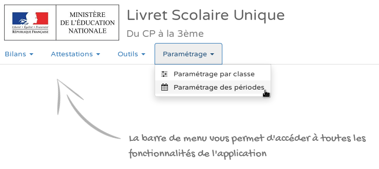

# Dates périodes incohérentes

## Message d'erreur

:::danger Attention

Les dates des périodes définies dans le fichier importé sont différentes de celles paramétrées dans LSU pour la classe **LIBELLE_CLASSE** (**\<id=ID_CLASSE>**). Vérifiez le paramétrage des périodes dans LSU et dans votre logiciel éditeur.

:::

## Pourquoi ?

Les dates des périodes paramétrées dans Opencomp ne sont pas identiques aux dates des périodes paramétrées dans LSU.

## Solution

Assurez vous de la **concordance des dates** entre les périodes définies **dans LSU** et les périodes définies **dans Opencomp**.

### Consulter les dates des périodes définies dans LSU

Pour consulter les dates des périodes définies dans LSU. Après vous être connecté sur LSU, cliquez sur **Paramétrage **>** Paramétrage des périodes**.

Sur la page qui vient de s'afficher dans l'application LSU, consultez les dates de la périodicité pour laquelle votre classe est affectée.

Dans l'exemple ci-dessous, nous voyons que la classe CE2 est affectée à la périodicité "**Semestre**" et que les dates des deux périodes sont **du 03/09/2018 au 08/02/2019** pour le **Semestre 1** et **du 09/02/2019 au 05/07/2019 **pour le **Semestre 2**.

:::caution Attention

Le nombre de périodes mais également les dates de début et de fin de chaque période **doivent correspondre** entre Opencomp et le LSU.

:::

### Ajuster les dates des périodes dans Opencomp

Demandez ensuite à votre directeur d'ajuster les périodes dans Opencomp.

* Une fois connecté en tant que directeur sur Opencomp, dans la barre latérale, sélectionnez le nom de votre établissement scolaire et cliquez sur **Paramétrer l'établissement**.
* Dans le cadre **Périodes**, modifiez successivement les périodes en cliquant sur **Modifier** pour faire correspondre les dates à celles définies dans LSU.

:::caution Attention

Dans Opencomp, les périodes ne peuvent pas se chevaucher. Arrangez-vous pour modifier les dates des périodes dans Opencomp dans un ordre n'entraînant pas de chevauchement.

:::

### Vérifier les dates des périodes dans Opencomp

Accédez à la liste des évaluations pour votre classe dans Opencomp en cliquant sur le bouton **Évaluations** de votre tableau de bord (la page d'accueil Opencomp).

Cliquez sur le bouton avec **l'icône d'un filtre et d'un calendrier** pour afficher les dates des périodes de votre établissement.

Assurez-vous que vous avez bien fait correspondre les dates de vos périodes avec celles configurées dans LSU. Si ce n'est pas le cas, modifiez à nouveau les périodes dans Opencomp.

Si tout est bon, effectuez un nouvel export en cliquant sur le bouton **Export LSU** depuis votre tableau de bord.
