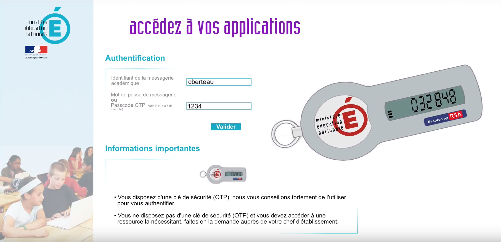
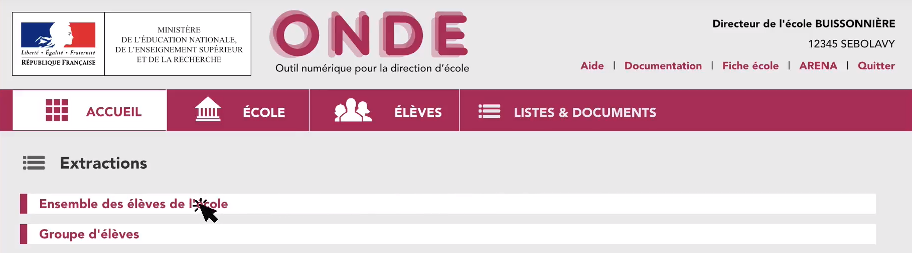

import IframeManagerComponent from "../../src/components/IframeManagerComponent.js";

# Extraire les élèves depuis ONDE

## Qu'est-ce que ONDE ?

ONDE (Outil Numérique pour la Direction d'École) est le nouveau nom de Base élèves 1er degré (appelé aussi BE1D ou Base-élèves). Il s'agit d'une application d’aide à l’inscription des élèves et à la gestion pour les directeurs d’école et les mairies de France.

## Intérêt d'extraire les élèves depuis ONDE

Lorsque vous créez votre classe dans Opencomp, vous pouvez soit saisir vos élèves manuellement, soit les importer depuis un fichier .csv provenant de ONDE.

Les fichiers .csv d'extraction provenant de ONDE contiennent les **INE (Identifiant National Élève) de vos élèves** mais également l'**Identifiant de votre classe dans ONDE**, nécessaire à l'export vers LSU.

Si vous saisissez manuellement vos élèves sans renseigner les INE, vous devrez nécessairement les saisir par la suite avant d'exporter vers LSU et renseigner l'identifiant ONDE de votre classe.

Importer directement le fichier .csv provenant d'ONDE permettra donc de vous éviter ensuite une saisie fastidieuse des INE de vos élèves.

:::caution Attention

**Conservez le fichier même après l'import dans Opencomp** car il contient l'identifiant ONDE de la classe. Vous en aurez besoin lors de l'export vers LSU depuis Opencomp.

L'identifiant ONDE de la classe est disponible dans la **colonne numéro 18 (colonne R)**, intitulée **Identifiant Classe**. Pour consulter le contenu du fichier .csv, vous pouvez utiliser un logiciel de tableur comme Microsoft Excel ou [Libre Office Calc](https://fr.libreoffice.org/download/libreoffice-stable/).

:::

## Pas à pas en vidéo

Une procédure pas à pas en vidéo a été réalisée pour vous guider dans le processus d'extraction d'élèves depuis ONDE.

<IframeManagerComponent/>

## Pas à pas en images

:::danger Attention

Dans cette étape, attention de bien sélectionner **Élèves de l'école ou leurs responsables** car l'extraction par Groupe d'élèves ne contient pas les INE des élèves ni l'identifiant de la classe dans ONDE.

:::

:::note

Bien qu'intitulée **Élèves de l'école ou leurs responsables**, il est possible ensuite de restreindre l'extraction à une classe donnée en renseignant des critères de filtrage.

:::

:::note

Le nom du fichier est **CSVExtraction.csv**

Si vous devez extraire plusieurs classes, répétez la procédure.\
Nous vous conseillons dans ce cas de renommer les fichiers extraits au fur et à mesure.

:::

:::note

Astuce : Vous pouvez ensuite communiquer le fichier correspondant à la classe de chaque enseignant en lui envoyant en pièce jointe dans un email par exemple.

:::

