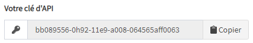
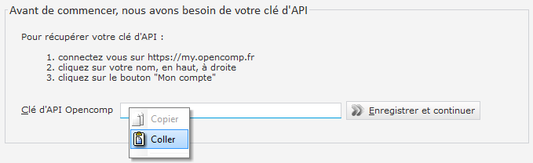

# Définir votre clé d'API

## Qu'est-ce que ma clé d'API ?

Votre clé d'API est un identifiant alpha-numérique unique qui permet à des applications tierces comme **Opencomp Genie** de dialoguer avec **Opencomp **pour récupérer certaines informations saisies précédemment sur **le service Web Opencomp** comme par exemple, les évaluations créées et la liste de vos élèves.

:::caution Attention

Votre clé d'API est une donnée **sensible et personnelle**. Elle permet d'accéder aux même données que lorsque vous utilisez** le service Web Opencomp** en vous identifiant avec votre adresse email et votre mot de passe.

Ne communiquez pas cette donnée à des tiers.

:::

## Comment récupérer ma clé d'API ?

Connectez vous au **service Web Opencomp** à l'adresse [https://my.opencomp.fr](https://my.opencomp.fr) puis cliquez sur votre nom, en haut, à droite, puis sur "**Mon compte**" ou accédez directement à la page [https://my.opencomp.fr/users/profile](https://my.opencomp.fr/users/profile)

## Comment définir ma clé d'API ?

Une fois votre clé d'API dans le presse papier, il ne vous reste plus qu'à la coller dans le champ prévu à cet effet lors du premier lancement du logiciel **Opencomp Genie**.

