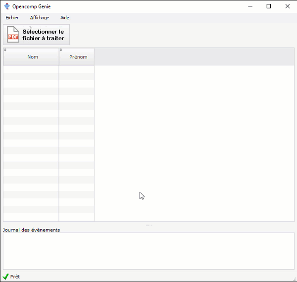

import IframeManagerComponent from "../../../../src/components/IframeManagerComponent.js";

# Détecter les résultats

Lors du premier lancement d'**Opencomp Genie**, vous devez renseigner **votre clé d'API Opencomp**.

Vous trouverez plus d'informations à ce sujet sur la page suivante :

<a class="pagination-nav__link" href="/saisir-les-resultats/utiliser-opencomp-genie/definir-votre-cle-dapi">
    
➜&nbsp;&nbsp;Définir votre clé d'API

</a>

 

## Processus général d'utilisation

Une fois en possession d'[un fichier PDF contenant la numérisation de vos copies](https://doc.opencomp.fr/saisir-les-resultats/utiliser-opencomp-genie/numeriser-mes-copies), vous pouvez utiliser **Opencomp Genie** pour détecter les résultats :

1. Cliquez sur le bouton **Sélectionner le fichier à traiter**.
2. Sélectionnez [le fichier PDF numérisé précédemment](https://doc.opencomp.fr/saisir-les-resultats/utiliser-opencomp-genie/numeriser-mes-copies).
3. Patientez le temps de la détection par **Opencomp Genie** des résultats de vos copies.
4. Cliquez sur **Envoyer **pour envoyer les résultats sur **Opencomp**.

## En savoir plus sur les différents statuts de traitement possibles

 
 
<IframeManagerComponent/>

| Code / couleur | Description                                                                                                                                                                          |
| -------------- | ------------------------------------------------------------------------------------------------------------------------------------------------------------------------------------ |
| DE (bleu)      | Résultat "**Dépassé**" détecté                                                                                                                                                       |
| A (vert)       | Résultat "**Atteint**" détecté                                                                                                                                                       |
| PA (orange)    | Résultat "**Partiellement atteint**" détecté                                                                                                                                         |
| NA (rouge)     | Résultat "**Non atteint**" détecté                                                                                                                                                   |
| ! (rouge)      | 
<strong>Nombre de connaissances et compétences évaluées</strong> <strong>détecté</strong><strong>différent du nombre défini dans Opencomp</strong> (la copie est ignorée)
 |
| ? (gris)       | 
Le logiciel n'a <strong>pas été en mesure de détecter le résultat</strong>(ou vous avez coché deux résultats).
                                                            |
| ∅ (beige)      | Vous avez **oublié de corriger** pour cette connaissance/compétence évaluée.                                                                                                         |
